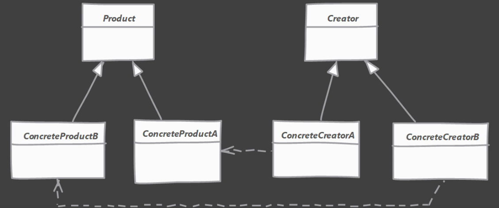

# Factory-Method-design-pattern

- Use the Factory Method when you don’t know beforehand the
  exact types and dependencies of the objects your code should
  work with.

OR

- When you want to add classes with similar functionalities without modifying the existing code

## Architectural diagram

### Explanation:

The Factory Method separates product construction code from
the code that actually uses the product. Therefore, it’s easier to
extend the product construction code independently from the
rest of the code.
For example, to add a new product type to the app, you’ll only
need to create a new creator subclass and override the factory
method in it.

### Difference between Simple Factory and Factory Method:

- Simple Factory: The factory method is a static method, which
  returns an instance of one of several possible classes that
  share a common superclass, based on the parameter passed to
  the factory method.
- Factory Method: The factory method is an instance method,
  which returns an instance of one of several possible classes
  that share a common superclass, based on the parameter passed
  to the factory method.

#### Also

- Factory Method: The factory method is defined in an abstract
  class, and the subclasses can override it to change the
  resulting product type. 
- Simple Factory: The factory method is defined in a separate
  class, and the resulting product type is hardcoded in the
  factory method code.